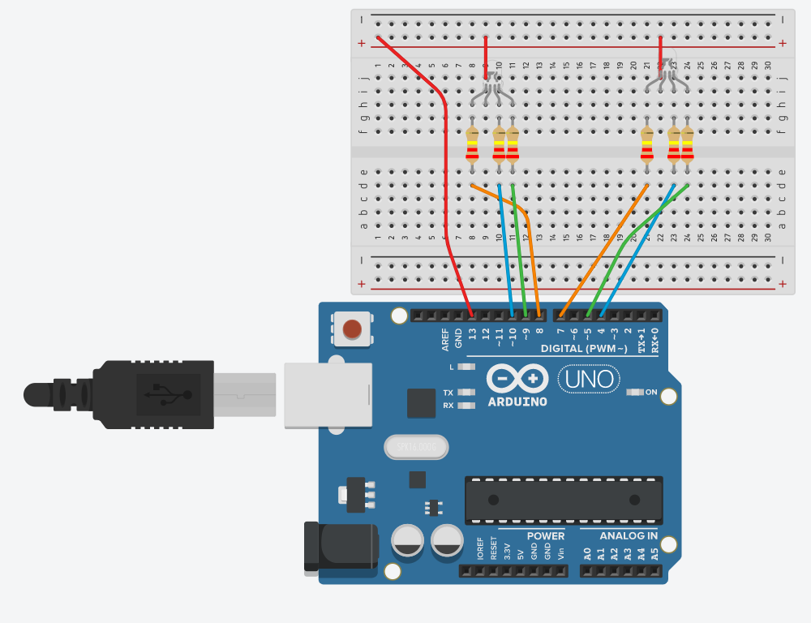

# ExpertCircuitPython
 The follwing files are my Coding Assignments in ExpertCircuitPython.
## Table of Contents
* [Table of Contents](#Table_Of_Contents)
* [LCD Count](#LCD_Count)
* [Classes, Objects, and Modules](#Classes_Objects_and_Modules)
* [Fun with RGB LEDs](#FunRGB)
---
## LCD_Count

### Description & Code
Create code and wire up a lcd board that when you touch one wire it will count upwards, and if you touch the second wire, it will change from counting up, to counting down. Display the number it is one and if it going up or down on the LCD board.

#### Code, Comments in code & Wiring created originally by [Jay Conklin](https://github.com/jconkli07/CircuitPython#circuitpython_lcd)


```python
#Code originally created by Jay Conklin
#Displays a count on the LCD that increases once every time a wire is touched.
#If a different wire is touched it changes it to counting down instead of up, or vice versa.
import board
from lcd.lcd import LCD
from lcd.i2c_pcf8574_interface import I2CPCF8574Interface
import time
import touchio

i2c = board.I2C()
lcd = LCD(I2CPCF8574Interface(i2c, 0x3f), num_rows=2, num_cols=16)      #Sets up the lcd board and tells code what pins it's in

touch_a5 = board.A5
touch_A5 = touchio.TouchIn(touch_a5)    #Sets up capacitative touch for the counter wire
touch_a0 = board.A0
touch_A0 = touchio.TouchIn(touch_a0)    #Sets up capacitative touch for the up/down wire

count = 0
updown=1

while True:
    if touch_A5.value:
        count+=updown   #If counter wire is touched adds updown variable to the counter number
                        #Updown will be 1 if going up or -1 if going down, so just adding
                        #it to the counter will make it count 1 in the correct direction
        lcd.clear()
        if updown==1:
            lcd.print("Up: ")
        else:
            lcd.print("Down: ")
        lcd.print(str(count))   #Above section displays direction of counting and new count
        while touch_A5.value:   #Waits until the wire is released to continue
            time.sleep(.01)     #that holding down the wire does not increase the number over and over

    if touch_A0.value:
        updown=-updown          #If direction wire touched changes updown from 1 to -1 or vice versa
        while touch_A0.value:
            time.sleep(.1)
        lcd.clear()
        if updown==1:
            lcd.print("Up: ")
        else:
            lcd.print("Down: ")
        lcd.print(str(count))   #Above section displays the new direction of counting and current count (the count stays the same)
  
```
### Evidence


this image shows the wiring for the capacitive touch part to this wiring, but just shows the lcd kind of connected. The photo below is the wiring diagram from [LastMinuteEngineers](https://lastminuteengineers.com/i2c-lcd-arduino-tutorial/), that shows the correct wiring of the LCD board.

### Reflection
For this assignment I used the resources I was given and went through the class accounts repository and went through the different students reposiotories and took someones code (Jay Conklin's) and gave him credit at the top of the assignment. Being able to take someones code and give credit correctly is a very useful tool that i will use a lot in my life if I countinue to persue engineering, programming, or really anything.


## Classes_Objects_and_Modules 

### Description & Code
"I want you to get an RGB blinking (or fading!), the way you're used to doing so.  AKA just get it working in a single file, at first. Once you've got it working, lets pull it apart into a module and a main/code.py file. Once you have the RGB LED blinking or fading with a class, the final step is to add a second RGB LED.  With classes, it will be so easy!"(Taken straight from the assignment page)
This is the first engieering assignment that I have done that envolves classes. Using the new classes and modules I make code to get a RGB LED to Fade up and down in succession.

```python
MAIN

import time
import board
from rgb import LED   # import the LED class from the rgb module

blueLEDPin1 = board.D10
redLEDPin1 = board.D8
greenLEDPin1 = board.D9

blueLEDPin2 = board.D4
redLEDPin2 = board.D7
greenLEDPin2 = board.D5

myBlueLED1 = LED(blueLEDPin1, "blue1")
myRedLED1 = LED(redLEDPin1, "red1")
myGreenLED1 = LED(greenLEDPin1, "green1")
myBlueLED2 = LED(blueLEDPin2, "blue2")
myRedLED2 = LED(redLEDPin2, "red2")
myGreenLED2 = LED(greenLEDPin2, "green2")

while True:
    myGreenLED1.fadeup()
    myGreenLED2.fadeup()
    #time.sleep(1)
    myBlueLED1.fadeup()
    myBlueLED2.fadeup()
    #time.sleep(1)
    myRedLED1.fadeup()
    myRedLED2.fadeup()
    #time.sleep(1)
    myBlueLED1.fadedown()
    myBlueLED2.fadedown()
    #time.sleep(1)
    myBlueLED1.fadeup()
    myBlueLED2.fadeup()
    #time.sleep(1)
    myRedLED1.fadedown()
    myRedLED2.fadedown()
    #time.sleep(1)
    myRedLED1.fadeup()
    myRedLED2.fadeup()
    #time.sleep(1)
    myGreenLED1.fadedown()
    myGreenLED2.fadedown()
    #time.sleep(1)

RGB 
# These are the libraries needed to fade an LED, even if you imported elsewhere
import time
import board
import pwmio
import digitalio

lightBulb = digitalio.DigitalInOut(board.D13)
lightBulb.direction = digitalio.Direction.OUTPUT


class LED:  # It's propper coding to always write a line explaining a class
    # with a "docstring."   Like this:
    """LED is a class designed for a single color LED to fade in and out"""

    def __init__(self, ledpin, name):
        # init is like void Setup() from arduino.  Initialize your pins here
        # start each object with "self.object"
        self.led = pwmio.PWMOut(ledpin, frequency=5000, duty_cycle=0)
        self.name = name

    def fadeUp(self):
        lightBulb.value = 65535
        for i in range(255):
            if i < (255 / 2):
                self.led.duty_cycle = int(i * 65535 / (255 / 2))

            print(self.name, ", ", self.led.duty_cycle)
            time.sleep(0.01)

    def fadeDown(self):
        lightBulb.value = 65535
        for i in range(255):
            if i > (255 / 2):
                self.led.duty_cycle = 65535 - int((i - (255 / 2)) * 65535 / (255 / 2))
            print(self.name, ", ", self.led.duty_cycle)
            time.sleep(0.01)

    def on(self, brightness=65535):  # Remember "on" means duty cycles < 65535
        self.led.duty_cycle = 65535 - brightness
        lightBulb.value = 65535

    def off(self):  # "off" means duty cycle should be full.
        self.led.duty_cycle = 65535


class RGB:
    from rgb import LED

    def __init__(self, redPin, bluePin, greenPin):
        self.myRedLED = LED(redPin, "red")
        self.myBlueLED = LED(bluePin, "blue")
        self.myGreenLED = LED(greenPin, "green")

    def red(self, brightness=65535):
        self.myRedLED.on(brightness)
        self.myBlueLED.off()
        self.myGreenLED.off()

    def blue(self, brightness=65535):
        self.myRedLED.off()
        self.myBlueLED.on(brightness)
        self.myGreenLED.off()

    def green(self, brightness=65535):
        self.myRedLED.off()
        self.myBlueLED.off()
        self.myGreenLED.on(brightness)

    def yellow(self, brightness=65535):
        self.myRedLED.on(brightness)
        self.myBlueLED.off
        self.myGreenLED.on(brightness)

    def cyan(self, brightness=65535):
        self.myRedLED.off()
        self.myBlueLED.on(brightness)
        self.myGreenLED.on(brightness)

    def magenta(self, brightness=65535):
        self.myRedLED.on(brightness)
        self.myBlueLED.on(brightness)
        self.myGreenLED.off()

    def off(self):
        self.myRedLED.off()
        self.myBlueLED.off()
        self.myGreenLED.off()
        lightBulb.value = 0

    def redBlinky(self, brightness=65535):
        self.myRedLED.fadeDown()
        time.sleep(0.3)
        self.myRedLED.fadeUp()
        time.sleep(0.3)

    def blueBlinky(self, brightness=65535):
        self.myBlueLED.fadeDown()
        time.sleep(0.3)
        self.myBlueLED.fadeUp()
        time.sleep(0.3)


    def greenBlinky(self, brightness=65535):
        self.myGreenLED.fadeDown()
        time.sleep(0.3)
        self.myGreenLED.fadeUp()
        time.sleep(0.3)

    def Rainbow(self, brightness = 65535):
        self.myRedLED.fadeDown()
        self.myGreenLED.fadeDown()
        self.myRedLED.fadeUp()
        self.myBlueLED.fadeDown()
        self.myGreenLED.fadeUp()
        self.myRedLED.fadeDown()
        self.myBlueLED.fadeUp()
        self.myRedLED.fadeUp()

    def ReverseRainbow(self, brightness = 65535):
        self.myRedLED.fadeDown()
        self.myBlueLED.fadeDown()
        self.myRedLED.fadeUp()
        self.myGreenLED.fadeDown()
        self.myBlueLED.fadeUp()
        self.myRedLED.fadeDown()
        self.myGreenLED.fadeUp()
        self.myRedLED.fadeUp()
```

### Evidence


### Reflection
In the Description I said "the first ENGINEERING assignment to envolve classes and modules" because I have worked with them in my Computer science class. While these classes are different then the CS ones, they have the same concepts. So after I figured out the RGB LED it was a pretty simple assignment to complete.

## FunRGB

### Description & Code
get two RGB LEDs lit up and working, then implement some methods to do special things, such as the method "Blinky" where we can decide what that means, "Fade Up" and "Fade Down" which do what they say, and other methods that we feel like making.

```python
MAIN

""" This file is the class-based version of making a single LED fade"""
import time
import board
from rgb import RGB  # import the LED class from the rgb module

redLEDPin1 = board.D8
greenLEDPin1 = board.D9
blueLEDPin1 = board.D10
blueLEDPin2 = board.D4
greenLEDPin2 = board.D5
redLEDPin2 = board.D7

full = 65535
half = int(65535 / 2)

myRGBled1 = RGB(redLEDPin1, blueLEDPin1, greenLEDPin1)
myRGBled2 = RGB(redLEDPin2, blueLEDPin2, greenLEDPin2)

while True:
    myRGBled1.blue()
    myRGBled2.yellow(half)
    time.sleep(1)
    myRGBled1.off()
    myRGBled2.off()
    time.sleep(2)

    myRGBled1.red()
    myRGBled2.cyan(half)
    time.sleep(1)
    myRGBled1.off()
    myRGBled2.off()
    time.sleep(2)

    myRGBled1.green()
    myRGBled2.magenta(half)
    time.sleep(1)
    myRGBled1.off()
    myRGBled2.off()
    time.sleep(2)

    myRGBled1.redBlinky()
    myRGBled2.blueBlinky()
    myRGBled1.off()
    myRGBled2.off()
    time.sleep(2)

    myRGBled1.Rainbow()
    myRGBled2.ReverseRainbow()
    time.sleep(1)
    myRGBled1.off()
    myRGBled2.off()
    time.sleep(2)

RGB 
# These are the libraries needed to fade an LED, even if you imported elsewhere
import time
import board
import pwmio
import digitalio

lightBulb = digitalio.DigitalInOut(board.D13)
lightBulb.direction = digitalio.Direction.OUTPUT


class LED:  # It's propper coding to always write a line explaining a class
    # with a "docstring."   Like this:
    """LED is a class designed for a single color LED to fade in and out"""

    def __init__(self, ledpin, name):
        # init is like void Setup() from arduino.  Initialize your pins here
        # start each object with "self.object"
        self.led = pwmio.PWMOut(ledpin, frequency=5000, duty_cycle=0)
        self.name = name

    def fadeUp(self):
        lightBulb.value = 65535
        for i in range(255):
            if i < (255 / 2):
                self.led.duty_cycle = int(i * 65535 / (255 / 2))

            print(self.name, ", ", self.led.duty_cycle)
            time.sleep(0.01)

    def fadeDown(self):
        lightBulb.value = 65535
        for i in range(255):
            if i > (255 / 2):
                self.led.duty_cycle = 65535 - int((i - (255 / 2)) * 65535 / (255 / 2))
            print(self.name, ", ", self.led.duty_cycle)
            time.sleep(0.01)

    def on(self, brightness=65535):  # Remember "on" means duty cycles < 65535
        self.led.duty_cycle = 65535 - brightness
        lightBulb.value = 65535

    def off(self):  # "off" means duty cycle should be full.
        self.led.duty_cycle = 65535


class RGB:
    from rgb import LED

    def __init__(self, redPin, bluePin, greenPin):
        self.myRedLED = LED(redPin, "red")
        self.myBlueLED = LED(bluePin, "blue")
        self.myGreenLED = LED(greenPin, "green")

    def red(self, brightness=65535):
        self.myRedLED.on(brightness)
        self.myBlueLED.off()
        self.myGreenLED.off()

    def blue(self, brightness=65535):
        self.myRedLED.off()
        self.myBlueLED.on(brightness)
        self.myGreenLED.off()

    def green(self, brightness=65535):
        self.myRedLED.off()
        self.myBlueLED.off()
        self.myGreenLED.on(brightness)

    def yellow(self, brightness=65535):
        self.myRedLED.on(brightness)
        self.myBlueLED.off
        self.myGreenLED.on(brightness)

    def cyan(self, brightness=65535):
        self.myRedLED.off()
        self.myBlueLED.on(brightness)
        self.myGreenLED.on(brightness)

    def magenta(self, brightness=65535):
        self.myRedLED.on(brightness)
        self.myBlueLED.on(brightness)
        self.myGreenLED.off()

    def off(self):
        self.myRedLED.off()
        self.myBlueLED.off()
        self.myGreenLED.off()
        lightBulb.value = 0

    def redBlinky(self, brightness=65535):
        self.myRedLED.fadeDown()
        time.sleep(0.3)
        self.myRedLED.fadeUp()
        time.sleep(0.3)

    def blueBlinky(self, brightness=65535):
        self.myBlueLED.fadeDown()
        time.sleep(0.3)
        self.myBlueLED.fadeUp()
        time.sleep(0.3)


    def greenBlinky(self, brightness=65535):
        self.myGreenLED.fadeDown()
        time.sleep(0.3)
        self.myGreenLED.fadeUp()
        time.sleep(0.3)

    def Rainbow(self, brightness = 65535):
        self.myRedLED.fadeDown()
        self.myGreenLED.fadeDown()
        self.myRedLED.fadeUp()
        self.myBlueLED.fadeDown()
        self.myGreenLED.fadeUp()
        self.myRedLED.fadeDown()
        self.myBlueLED.fadeUp()
        self.myRedLED.fadeUp()

    def ReverseRainbow(self, brightness = 65535):
        self.myRedLED.fadeDown()
        self.myBlueLED.fadeDown()
        self.myRedLED.fadeUp()
        self.myGreenLED.fadeDown()
        self.myBlueLED.fadeUp()
        self.myRedLED.fadeDown()
        self.myGreenLED.fadeUp()
        self.myRedLED.fadeUp()
```

### Evidence


### Reflection
After getting the first few methods functioning and working, the following code/methods after that were pretty simple to do. The only thing that is really improtant to remember for the future is that you need to figure out which of the two RGB LEDs you have, cause you can either have the normal one, where if you want green you put in (0, 255, 0), or the reversed one, where you would say, (255, 0, 255).
