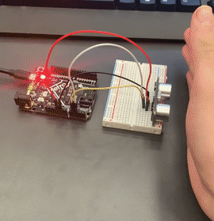

# CircuitPython
 The follwing files are my first foray into CircuitPython.
## Table of Contents
* [Table of Contents](#TableOfContents)
* [Hello_CircuitPython](#Hello_CircuitPython)
* [CircuitPython_Servo](#CircuitPython_Servo)
* [CircuitPython_UltraSensor](#CircuitPython_UltraSensor)
* [CircuitPythonPhotoInterupter](#CircuitPython_PhotoInterupter)
---

## Hello_CircuitPython

### Description & Code
Take the code you are given and see if it works correctly and outputs the right color on your neopixel

```python
import board
import neopixel

dot = neopixel.NeoPixel(board.NEOPIXEL, 1)

print("Make it red!")

while True:
    dot.fill((255,0,0))
```

### Evidence
Pictures / Gifs of your work should go here

### Reflection
Nothing really happened that was of importance in this assignment, other than figuring out rgb values, and that they always have to be integers, and it is rgb not rbg.


## CircuitPython_Servo

### Description & Code
Create code for that makes a servo sweep between 0 and 180, then add a capacitive touch feature so that when you touch one wire, it will go one way, if you touch the other one, it will go the other way.

```python
import time
import board
import touchio
import pwmio
import servo

pwm = pwmio.PWMOut(board.A3, duty_cycle=2 ** 15, frequency=50)

my_servo = servo.Servo(pwm)

touch_A1 = touchio.TouchIn(board.A1)
touch_A2 = touchio.TouchIn(board.A2)

while True:
    if touch_A1.value:
        print("Touched A1!")
        my_servo.angle = 90
    time.sleep(0.05)
    if touch_A2.value:
        print("Touched A2!")
        my_servo.angle = 0
    time.sleep(0.05)
```

### Evidence
 
 
 A gif of the capactive touch servo working
### Wiring
 
### Reflection
This assignment was not very difficult, which is to be expected, being one of the first assignments of the year. Making the capacitive touch part was a little tricky, but there are many helpful websites on the internet explaining how to do it.

## CircuitPython_UltraSensor

### Description & Code
Use the HC-SR04 to measure the distance to an object and print that out to your serial monitor in cm. Then, you had to get the neopixel to turn red, when below 5cm, blue, when between 5 and 20cm, and green, when above 20cm. After that, your final version of the code, the color will shift on a gradient and shift the neopixel's color slowly as the object gets closer or farther away from the distance sensor.

```python
import time
import board
import adafruit_hcsr04
import neopixel

sonar = adafruit_hcsr04.HCSR04(trigger_pin=board.A1, echo_pin=board.A2)
dot = neopixel.NeoPixel(board.NEOPIXEL, 1)
print("new code")
cm = 0
r = 0
g = 0
b = 0
while True:
    try:
        cm = sonar.distance
        print((cm))
        if cm <= 5:
            r = 255
            g = 0
            b = 0
        elif cm <= 20:
            r = int(255 - ((cm - 5) / 15 * 255))  #
            g = 0
            b = int((cm - 5) / 15 * 255)
        elif cm <= 35:
            r = 0
            g = int((cm - 20) / 15 * 255)
            b = int(255 - ((cm - 20) / 15 * 255))
            print((r, g, b))
        else:
            r = 0
            g = 255
            b = 0
        dot.fill((r, g, b))
    except RuntimeError:
        print("Retrying!")
    time.sleep(0.1)
```
### Evidence
 
### Wiring

### Reflection 
This assignment was not the hardest after i figured out the right equations for the rgb settings, then it was pretty simple from there on. 

## CircuitPython_PhotoInterupter

### Description & Code

```python
from digitalio import DigitalInOut, Direction, Pull
import time
import board

interrupter = DigitalInOut(board.D7)
interrupter.direction = Direction.INPUT
interrupter.pull = Pull.UP

counter = 0

photo = False
state = False

timer = 4
start = time.time()
while True:
    photo = interrupter.value
    if photo and not state:
            counter += 1
    state = photo

    remaining = timer - time.time()

    if remaining <= 0:
        print("I have been interrupted", str(counter), "times")
        timer = time.time() + 4
        counter = 0
```

### Evidence

### Wiring 

### Reflection
