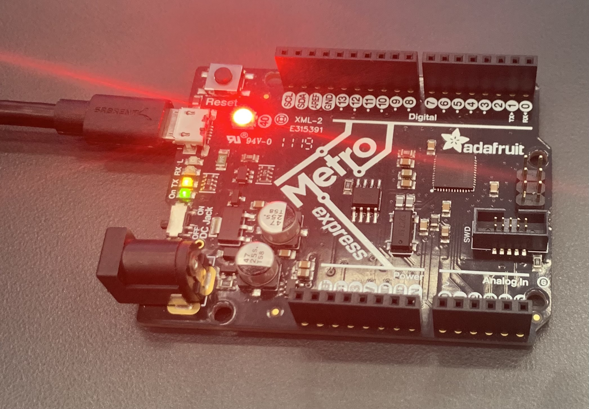

# CircuitPython
 The follwing files are my first foray into CircuitPython.
## Table of Contents
* [Table of Contents](#TableOfContents)
* [Hello_CircuitPython](#Hello_CircuitPython)
* [CircuitPython_Servo](#CircuitPython_Servo)
* [CircuitPython_UltraSensor](#CircuitPython_UltraSensor)
* [CircuitPythonPhotoInterupter](#CircuitPython_PhotoInterupter)
---

## Hello_CircuitPython

### Description & Code
Take the code you are given and see if it works correctly and outputs the right color on your neopixel

```python
`//these two imports are used to import the two libraries that I need to use for this code`
import board
import neopixel

dot = neopixel.NeoPixel(board.NEOPIXEL, 1)

print("Make it red!")

while True:
    //sets the dot rgb equal to red
    dot.fill((255,0,0))
```

### Evidence

No wiring required for this assignment, all that was used was the neopixel that is attached to the metro express board.
### Reflection
Nothing really happened that was of importance in this assignment, other than figuring out rgb values, and that they always have to be integers, and it is rgb not rbg.


## CircuitPython_Servo

### Description & Code
Create code for that makes a servo sweep between 0 and 180, then add a capacitive touch feature so that when you touch one wire, it will go one way, if you touch the other one, it will go the other way.

```python
import time
import board
import touchio
import pwmio
import servo

pwm = pwmio.PWMOut(board.A3, duty_cycle=2 ** 15, frequency=50)

my_servo = servo.Servo(pwm)

`//creates the capacitive touch for the code with these two commands`
touch_A1 = touchio.TouchIn(board.A1)
touch_A2 = touchio.TouchIn(board.A2)

while True:
    `//when you touch the A1 wire it turns the servo angle to 90 degrees and then waits for a very short time`
    if touch_A1.value:
        print("Touched A1!")
        my_servo.angle = 90
    time.sleep(0.05)
    `//when you touch the A2 wire it turns the servo angle to 0 degrees and then waits for a very short time`
    if touch_A2.value:
        print("Touched A2!")
        my_servo.angle = 0
    time.sleep(0.05)
```

### Evidence
 
 
 A gif of the capactive touch servo working
### Wiring
 
### Reflection
This assignment was not very difficult, which is to be expected, being one of the first assignments of the year. Making the capacitive touch part was a little tricky, but there are many helpful websites on the internet explaining how to do it.

## CircuitPython_UltraSensor

### Description & Code
Use the HC-SR04 to measure the distance to an object and print that out to your serial monitor in cm. Then, you had to get the neopixel to turn red, when below 5cm, blue, when between 5 and 20cm, and green, when above 20cm. After that, your final version of the code, the color will shift on a gradient and shift the neopixel's color slowly as the object gets closer or farther away from the distance sensor.

```python
import time
import board
import adafruit_hcsr04
import neopixel

sonar = adafruit_hcsr04.HCSR04(trigger_pin=board.A1, echo_pin=board.A2)
dot = neopixel.NeoPixel(board.NEOPIXEL, 1)
print("new code")

`//creates and defines the new variables: cm, r, g, b`
cm = 0
r = 0
g = 0
b = 0
while True:
    try:
        `//takes the sonar.distance that the ultrasonic sensor gathers, and then sets variable cm equal to that`
        cm = sonar.distance
        print((cm))
        `//when the cm is less than or equal to 5 the color the neopixel outputs is red`
        if cm <= 5:
            r = 255
            g = 0
            b = 0
        `//as the cm approaches 20 cm from 5 cm the color changes on a gradient towards blue`
        elif cm <= 20:
            r = int(255 - ((cm - 5) / 15 * 255))  #
            g = 0
            b = int((cm - 5) / 15 * 255)
        `//as the cm approaches 35 cm from 20 cm the color changes on a gradient towards green`
        elif cm <= 35:
            r = 0
            g = int((cm - 20) / 15 * 255)
            b = int(255 - ((cm - 20) / 15 * 255))
            print((r, g, b))
        `//after it reaches 35 cm or more, it stays at green`
        else:
            r = 0
            g = 255
            b = 0
        dot.fill((r, g, b))
    `//if the distance sensor can not gather a value for the distance it will output "Retrying!"`
    except RuntimeError:
        print("Retrying!")
    time.sleep(0.1)
```
### Evidence
 
### Wiring


[Image credit goes to Lucy G.](https://github.com/lgray52/CircuitPython)
### Reflection 
This assignment was not the hardest after i figured out the right equations for the rgb settings, then it was pretty simple from there on. The RGB equations were given to us as part of the assignment, so all i had to do was plug those equations in for the right values of RG and B, and also understand what those equations were actually doing.

## CircuitPython_PhotoInterupter

### Description & Code

```python
from digitalio import DigitalInOut, Direction, Pull
import time
import board

interrupter = DigitalInOut(board.D7)
interrupter.direction = Direction.INPUT
interrupter.pull = Pull.UP

counter = 0

photo = False
state = False

timer = 4
start = time.time()
while True:
    photo = interrupter.value
    if photo and not state:
            counter += 1
    state = photo

    remaining = timer - time.time()

    if remaining <= 0:
        print("I have been interrupted", str(counter), "times")
        timer = time.time() + 4
        counter = 0
```

### Evidence

### Wiring 

### Reflection

